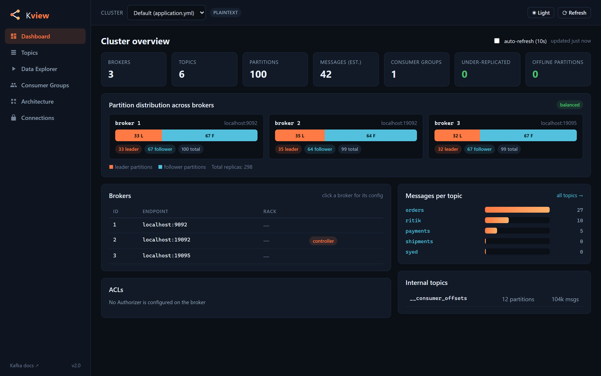
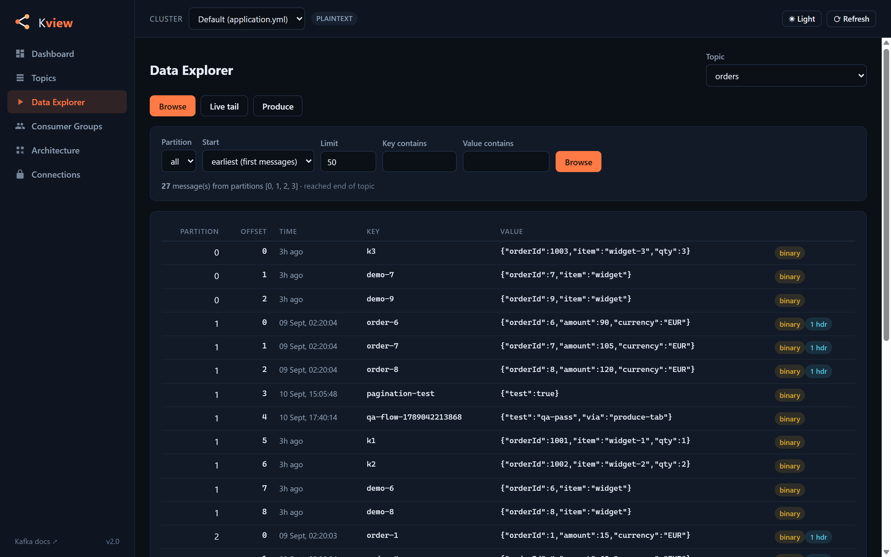
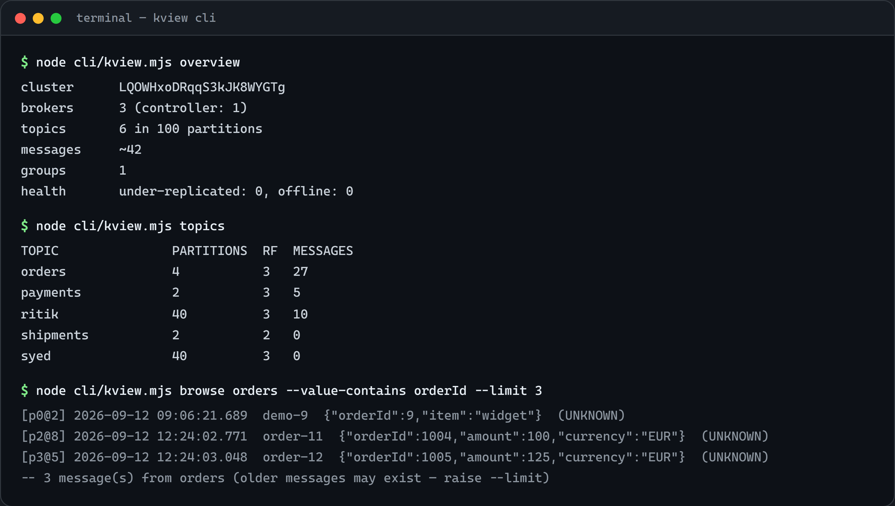
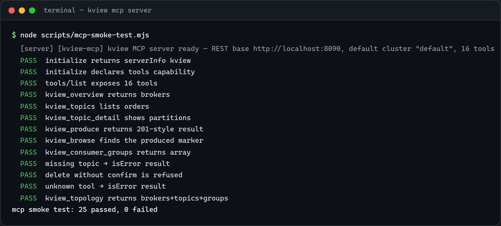

<p align="center">
  
</p>

<p align="center">
  <a href="LICENSE"></a>
  <a href="https://github.com/ritikbansod/kview/actions/workflows/ci.yml"></a>
  <a href="https://github.com/ritikbansod/kview/releases"></a>
</p>

# Kview

A web UI, REST API and CLI for Apache Kafka. Point it at a cluster and browse topics and
messages, tail topics live, watch consumer group lag, produce test messages and manage
topics. Connect as many clusters as you want at runtime and switch between them from the
sidebar.

<p align="center">
  
</p>

## What is Kview?

Kview is a self-hosted tool for people who work with Kafka clusters. Instead of poking
around with console scripts or scattered CLI flags, you get one interface for the
everyday questions: what topics exist, what is inside them, how far behind are my
consumers, is every partition replicated.

It is built on the official Apache Kafka Java client, so it works with any distribution
that speaks the Kafka protocol: Apache Kafka 2.1 to 4.x, Strimzi, Confluent Cloud,
Confluent Platform, Redpanda, Amazon MSK, Azure Event Hubs, Aiven and others. Security
support covers PLAINTEXT, TLS, mTLS and SASL (PLAIN / SCRAM-SHA-256 / SCRAM-SHA-512 /
OAUTHBEARER). [COMPATIBILITY.md](COMPATIBILITY.md) has the exact settings per distribution.

Browsing and tailing are read-only: Kview never commits offsets and never joins a real
consumer group, so it is safe to point at production topics.

## What it can do

- **Dashboard**: brokers with full config viewer, controller, topic/partition counts,
  under-replicated and offline partitions, messages per topic, ACLs, optional 10s auto refresh.
- **Topics**: leaders, replicas, ISR, begin/end offsets, message counts and configs.
  Create and delete topics, increase partitions, edit configs.
- **Data explorer**: read messages (latest N, exact offsets, from a timestamp, filter by
  key or value contains), pretty-printed JSON with a copy button, live tail over SSE,
  reproduce a message to any topic with one click.
- **Produce**: key, value, partition, timestamp and headers, with JSON validation as you type.
- **Consumer groups**: state, per-partition lag with bars, member assignments, delete a
  group, reset offsets (earliest / latest / exact offset / timestamp).
- **Connections**: add, edit, test and reconnect clusters at runtime. Secrets are stored
  server-side and never sent back to the browser.

## Three ways to use it

> [!WARNING]
> **Network Security:** Kview has no built-in authentication on its REST API and binds to `127.0.0.1` by default. If deploying to a shared server or network, place it behind an authenticating reverse proxy (e.g., OAuth2-Proxy, NGINX, Caddy, Cloudflare Access). See [SECURITY.md](SECURITY.md) for details.

### 1. Web UI

**Option A — Docker (recommended):**
```bash
# Point at an existing Kafka broker:
docker run -d -p 8090:8090 -e KAFKA_BOOTSTRAP_SERVERS=localhost:9092 ghcr.io/ritikbansod/kview:latest

# Or spin up Kafka broker + Kview together:
docker compose up -d
```

**Option B — Standalone JAR (needs Java 21+):**
Download `kview-1.0.0.jar` from [Releases](https://github.com/ritikbansod/kview/releases):
```bash
java -jar kview-1.0.0.jar
```

**Option C — Build from source (needs Java 21 and Maven):**
```bash
mvn package
java -jar target/kview-1.0.0.jar
```

Then open http://localhost:8090. It connects to `localhost:9092` by default, set
`KAFKA_BOOTSTRAP_SERVERS` to point somewhere else. The app also starts fine when
nothing is reachable — pages just indicate "cluster unreachable" until a broker answers.

The explorer is where you spend most of your time: pick a topic, filter, click a message
to read it, or tail the topic live.



Dark and light themes are included (follows your system setting), and the layout works
on smaller screens.

### 2. CLI

`cli/kview.mjs` is a dependency-free Node 18+ client that talks to a running Kview
server, local or remote. The same things you do in the UI, from a terminal or a CI script:



```bash
node cli/kview.mjs overview                              # cluster KPIs
node cli/kview.mjs topics                                # all topics with counts
node cli/kview.mjs browse orders --start latest --limit 10
node cli/kview.mjs tail orders                           # live stream over SSE
node cli/kview.mjs produce orders -k k1 -v '{"orderId":42}' -H source=ci
node cli/kview.mjs topic-create my-topic --partitions 3 --rf 3
node cli/kview.mjs groups                                # consumer groups + lag
node cli/kview.mjs lag my-group
node cli/kview.mjs reset-offsets my-group latest
```

Point it at another server with `--server http://host:port` (or env `KVIEW_URL`) and
another cluster with `--cluster ID` (env `KVIEW_CLUSTER`). `--json` gives raw output for
scripting. A second client, `kview-cli.js`, ships in the repo with a similar command set.

### 3. MCP server (AI assistants)

`mcp/kview-mcp.js` is a [Model Context Protocol](https://modelcontextprotocol.io) server
that exposes Kview as 16 tools, so Claude Desktop, Cursor, ZCode or any MCP client can
inspect and operate your Kafka cluster in natural language: cluster health, topic
inventory, message browsing with filters, producing test events, consumer-group lag and
broker distribution. Zero dependencies, speaks newline-delimited JSON-RPC over stdio.
Deleting a topic through MCP requires an explicit `confirm=true` from the AI, so a
hallucinated destructive call gets refused.



Hook it into Claude Desktop (`claude_desktop_config.json`):

```json
{
  "mcpServers": {
    "kview": {
      "command": "node",
      "args": ["/absolute/path/to/kview/mcp/kview-mcp.js"],
      "env": { "KVIEW_URL": "http://localhost:8090" }
    }
  }
}
```

Claude Code / ZCode CLI:

```bash
claude mcp add kview -- node /absolute/path/to/kview/mcp/kview-mcp.js
```

Any other stdio MCP client works the same way: command `node`, args
`["/absolute/path/to/kview/mcp/kview-mcp.js"]`, env `KVIEW_URL` (and optional
`KVIEW_CLUSTER`, default `default`). Check your setup without a client:

```bash
node scripts/mcp-smoke-test.mjs   # 25 checks incl. produce -> browse round-trip
```

The tools wrap the same REST API as the UI and CLI (mounted under
`/api/clusters/{clusterId}/...`), so you can also wire your own scripts against those
endpoints directly. Connection tester at `POST /api/clusters/test`, health check at
`/actuator/health`.

## Connecting to a cluster

Go to Connections -> Add cluster (or `POST /api/clusters`). What you need for each setup:

| Setup | Fields |
|---|---|
| local dev cluster | protocol `PLAINTEXT`, bootstrap servers |
| TLS | truststore as file or pasted PEM, hostname verification toggle |
| mTLS (e.g. Strimzi) | CA PEM plus client certificate and key (PEM or keystore) |
| SASL | `PLAIN` or `SCRAM-SHA-256/512` with username/password. Confluent Cloud is PLAIN with the API key as username |
| OAuth2 | token endpoint URL, client id, secret, optional scope. Tokens are fetched and refreshed automatically (Keycloak, Entra ID, Okta etc) |

Secrets live in `data/connections.json` on the server and are never sent back to the
browser. The API returns masked values, and saving a masked value keeps the stored secret.

## Configuration

| Env var | Default | Meaning |
|---|---|---|
| `KAFKA_BOOTSTRAP_SERVERS` | `localhost:9092` | bootstrap servers of the default cluster |
| `KVIEW_BIND` | `127.0.0.1` | address to bind to (`0.0.0.0` in Docker container) |
| `KVIEW_DATA_DIR` | `./data` | where connections.json is stored |
| `server.port` (application.yml) | `8090` | http port |

## Roadmap

- Schema Registry support, design in [SCHEMA-REGISTRY-PLAN.md](SCHEMA-REGISTRY-PLAN.md)
- Message replay: copy a filtered set of messages to another topic or cluster
- Prometheus metrics for lag and produce rate
- Authentication for the API itself

## Contributing

Bug reports, suggestions, and pull requests are welcome. See [CONTRIBUTING.md](CONTRIBUTING.md)
for development guidelines. If you want to check compatibility against a distribution,
`node scripts/verify-compatibility.mjs` re-runs the verification matrix against a local broker.

## License

This project is licensed under the [Apache License, Version 2.0](LICENSE).

## Trademarks

Apache®, Apache Kafka®, Kafka®, and the Apache feather logo are trademarks or registered trademarks of the Apache Software Foundation in the United States and/or other countries. Kview is an independent open-source project and is not affiliated with, endorsed by, or sponsored by the Apache Software Foundation. All other trademarks, service marks, and company names (such as Confluent, Redpanda, Strimzi, AWS, Azure) are the property of their respective owners.
