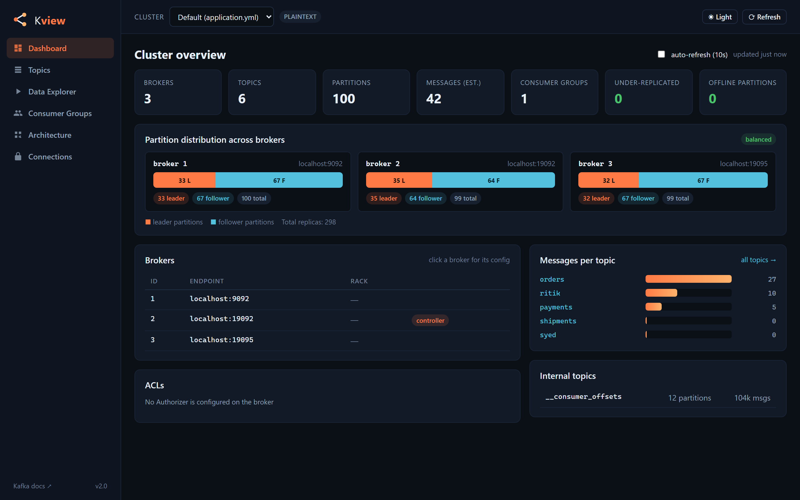
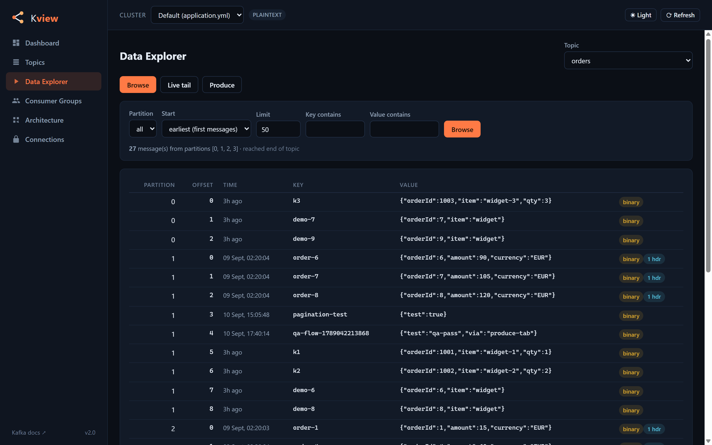
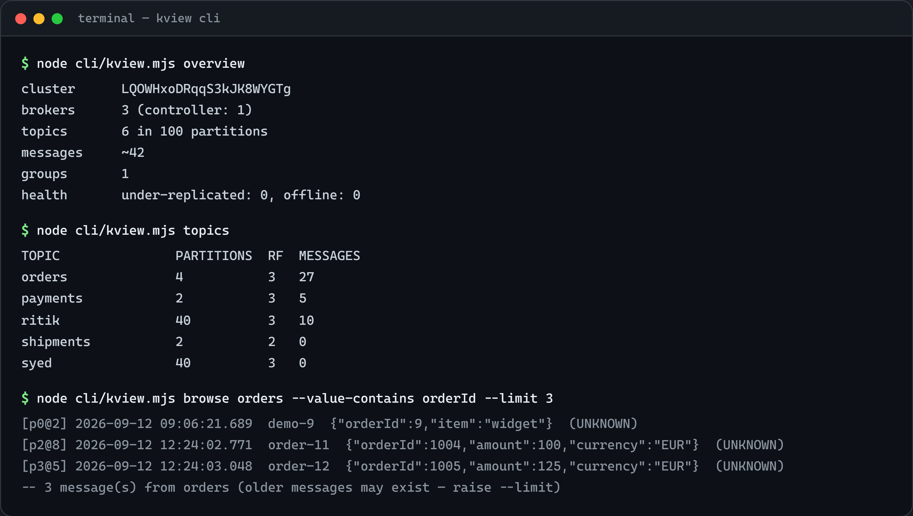
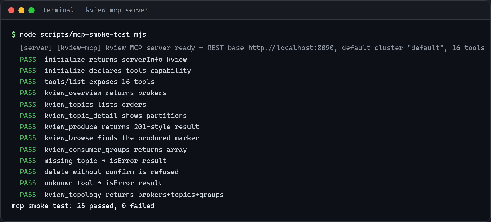

<p align="center">
  
</p>

<p align="center">
  <a href="LICENSE"></a>
  <a href="https://github.com/ritikbansod/kview/actions/workflows/ci.yml"></a>
  <a href="https://github.com/ritikbansod/kview/releases"></a>
</p>

# Kview

A web UI, REST API and CLI for Apache Kafka. Point it at a cluster and browse topics and
messages, tail topics live, watch consumer group lag, produce test messages and manage
topics. Connect as many clusters as you want at runtime and switch between them from the
sidebar.

<p align="center">
  
</p>

## What is Kview?

Kview is a self-hosted tool for people who work with Kafka clusters. Instead of poking
around with console scripts or scattered CLI flags, you get one interface for the
everyday questions: what topics exist, what is inside them, how far behind are my
consumers, is every partition replicated.

It is built on the official Apache Kafka Java client, so it works with any distribution
that speaks the Kafka protocol: Apache Kafka 2.1 to 4.x, Strimzi, Confluent Cloud,
Confluent Platform, Redpanda, Amazon MSK, Azure Event Hubs, Aiven and others. Security
support covers PLAINTEXT, TLS, mTLS and SASL (PLAIN / SCRAM-SHA-256 / SCRAM-SHA-512 /
OAUTHBEARER). [COMPATIBILITY.md](COMPATIBILITY.md) has the exact settings per distribution.

## Install

| Channel | Get it | Needs |
| --- | --- | --- |
| **JAR** | [Releases](https://github.com/ritikbansod/kview/releases) → `kview.jar` — starts the server UI, or the direct CLI: `java -jar kview.jar --cli topics --bootstrap-server localhost:9092` | Java 21+ |
| **Native bundles** | Releases → `kview-<v>-linux-x64.tar.gz` / `kview-<v>-macos-aarch64.tar.gz` / `kview-<v>-windows-x64.zip` (also a Linux `.deb`) — bundled JRE, server launcher **and** `kview` CLI | nothing |
| **npm** | `npm install -g kview` → `kview` (thin client; direct mode when a jar/`KVIEW_JAR` is present) and `npx kview-mcp` | Node 18+ |
| **Docker** | `docker run -d -p 8090:8090 ghcr.io/ritikbansod/kview:latest` — CLI passthrough: `docker run --rm ghcr.io/ritikbansod/kview --cli topics --bootstrap-server host:9092` — also mirrored to Docker Hub on release (see [docs/RELEASING.md](docs/RELEASING.md)) | Docker |
| **Homebrew** | tap `ritikbansod/homebrew-kview`, then `brew install kview` | macOS/Linux |

Browsing and tailing are read-only: Kview never commits offsets and never joins a real
consumer group, so it is safe to point at production topics.

## What it can do

- **Dashboard**: brokers with full config viewer, controller, topic/partition counts,
  under-replicated and offline partitions, messages per topic, ACLs, optional 10s auto refresh.
- **Topics**: leaders, replicas, ISR, begin/end offsets, message counts and configs.
  Create and delete topics, increase partitions, edit configs.
- **Data explorer**: read messages (latest N, exact offsets, from a timestamp, filter by
  key or value contains), whole-topic background search with regex filters and progress,
  pretty-printed JSON with a copy button, live tail over SSE,
  reproduce a message to any topic with one click.
- **Produce**: key, value, partition, timestamp and headers, with JSON validation as you type.
- **Consumer groups**: state, per-partition lag with bars, member assignments, delete a
  group, reset offsets (earliest / latest / exact offset / timestamp).
- **Message replay (DLQ triage)**: bulk-copy filtered messages to another topic — same or
  another connected cluster — with keys, headers and original timestamps preserved, and a
  dry-run preview.
- **Prometheus metrics**: `/actuator/prometheus` exposes per-cluster health (topics,
  partitions, under-replicated and offline partitions, reachability) and per-group
  consumer lag (`kview_*` series, sampled every 15s so scrapes never block) plus a
  produced-messages counter — point Grafana at it.
- **Connections**: add, edit, test and reconnect clusters at runtime. Secrets are stored
  server-side and never sent back to the browser.

## Three ways to use it

> [!NOTE]
> **Network Security:** Kview binds to `127.0.0.1` by default and the API is unauthenticated in that mode — fine for a single-user machine. For shared servers, enable the built-in authentication (`KVIEW_AUTH_MODE=token` or `oidc`, see [Authentication](#authentication)) or place it behind an authenticating reverse proxy. See [SECURITY.md](SECURITY.md) for details.

### 1. Web UI

**Option A — Docker (recommended):**

```bash
# Point at an existing Kafka broker:
docker run -d -p 8090:8090 -e KAFKA_BOOTSTRAP_SERVERS=localhost:9092 ghcr.io/ritikbansod/kview:latest

# Or spin up Kafka broker + Kview together:
docker compose up -d
```

**Option B — Standalone JAR (needs Java 21+):**
Download `kview-1.1.0.jar` from [Releases](https://github.com/ritikbansod/kview/releases):

```bash
java -jar kview-1.1.0.jar
```

**Option C — Build from source (needs Java 21 and Maven):**

```bash
mvn package
java -jar target/kview-1.1.0.jar
```

Then open http://localhost:8090. It connects to `localhost:9092` by default, set
`KAFKA_BOOTSTRAP_SERVERS` to point somewhere else. The app also starts fine when
nothing is reachable — pages just indicate "cluster unreachable" until a broker answers.

The explorer is where you spend most of your time: pick a topic, filter, click a message
to read it, or tail the topic live.



Dark and light themes are included (follows your system setting), and the layout works
on smaller screens.

### 2. CLI

Two modes. **Direct mode** (no server) talks to the broker straight from the jar — like
`kafka-topics.sh`, reusing Kview's services, so browse and search come out schema-decoded:

```bash
java -jar kview.jar --cli topics --bootstrap-server localhost:9092
java -jar kview.jar --cli browse orders --start earliest --limit 10
java -jar kview.jar --cli search orders --value-regex '"orderId"\s*:\s*"ORD-[0-9]+"'
java -jar kview.jar --cli lag orders-worker --bootstrap-server localhost:9092
```

`--help` lists every command plus security flags (`--security-protocol`, `--sasl-*`,
`--truststore-*`, `--oauth-*`) and `--schema-registry URL` for payload decoding. The repo's
`kview` / `kview.cmd` wrapper scripts pick up the jar next to them, so `kview topics` works
once the jar is alongside. Every command also takes `--json` for scripting.

**Thin-client mode** (no JVM on your laptop) talks to a running Kview server instead —
useful from CI or when the server holds the cluster credentials:
`cli/kview.mjs` is a dependency-free Node 18+ client that talks to a running Kview
server, local or remote. The same things you do in the UI, from a terminal or a CI script:



```bash
node cli/kview.mjs overview                              # cluster KPIs
node cli/kview.mjs topics                                # all topics with counts
node cli/kview.mjs browse orders --start latest --limit 10
node cli/kview.mjs tail orders                           # live stream over SSE
node cli/kview.mjs produce orders -k k1 -v '{"orderId":42}' -H source=ci
node cli/kview.mjs topic-create my-topic --partitions 3 --rf 3
node cli/kview.mjs groups                                # consumer groups + lag
node cli/kview.mjs lag my-group
node cli/kview.mjs reset-offsets my-group --topic orders --mode latest
```

Point it at another server with `--server http://host:port` (or env `KVIEW_URL`) and
another cluster with `--cluster ID` (env `KVIEW_CLUSTER`). `--json` gives raw output for
scripting. If the server runs with authentication enabled, add `--token <T>` (env `KVIEW_TOKEN`).

### 3. MCP server (AI assistants)

`mcp/kview-mcp.js` is a [Model Context Protocol](https://modelcontextprotocol.io) server
that exposes Kview as 19 tools, so Claude Desktop, Cursor, ZCode or any MCP client can
inspect and operate your Kafka cluster in natural language: cluster health, topic
inventory, message browsing with filters, producing test events, consumer-group lag and
broker distribution. Zero dependencies, speaks newline-delimited JSON-RPC over stdio.
Deleting a topic through MCP requires an explicit `confirm=true` from the AI, so a
hallucinated destructive call gets refused.



Hook it into Claude Desktop (`claude_desktop_config.json`):

```json
{
  "mcpServers": {
    "kview": {
      "command": "node",
      "args": ["/absolute/path/to/kview/mcp/kview-mcp.js"],
      "env": { "KVIEW_URL": "http://localhost:8090" }
    }
  }
}
```

Claude Code / ZCode CLI:

```bash
claude mcp add kview -- node /absolute/path/to/kview/mcp/kview-mcp.js
```

Any other stdio MCP client works the same way: command `node`, args
`["/absolute/path/to/kview/mcp/kview-mcp.js"]`, env `KVIEW_URL` (and optional
`KVIEW_CLUSTER`, default `default`; `KVIEW_TOKEN` when the server runs with authentication;
`KVIEW_ALLOWED_TOOLS` restricts the served tools to a comma-separated allowlist, e.g. only
read-only tools for an AI agent). Check your setup without a client:

```bash
node scripts/mcp-smoke-test.mjs   # 25 checks incl. produce -> browse round-trip
```

The tools wrap the same REST API as the UI and CLI (mounted under
`/api/clusters/{clusterId}/...`), so you can also wire your own scripts against those
endpoints directly. Connection tester at `POST /api/clusters/test`, health check at
`/actuator/health`.

## Connecting to a cluster

Go to Connections -> Add cluster (or `POST /api/clusters`). What you need for each setup:

| Setup | Fields |
| --- | --- |
| local dev cluster | protocol `PLAINTEXT`, bootstrap servers |
| TLS | truststore as file or pasted PEM, hostname verification toggle |
| mTLS (e.g. Strimzi) | CA PEM plus client certificate and key (PEM or keystore) |
| SASL | `PLAIN` or `SCRAM-SHA-256/512` with username/password. Confluent Cloud is PLAIN with the API key as username |
| OAuth2 | token endpoint URL, client id, secret, optional scope. Tokens are fetched and refreshed automatically (Keycloak, Entra ID, Okta etc) |

Secrets live in `data/connections.json` on the server and are never sent back to the
browser. The API returns masked values, and saving a masked value keeps the stored secret.

## Configuration

| Env var | Default | Meaning |
| --- | --- | --- |
| `KAFKA_BOOTSTRAP_SERVERS` | `localhost:9092` | bootstrap servers of the default cluster |
| `KVIEW_BIND` | `127.0.0.1` | address to bind to (`0.0.0.0` in Docker container) |
| `KVIEW_DATA_DIR` | `./data` | where connections.json is stored |
| `KVIEW_AUTH_MODE` | `none` | API authentication: `none`, `token` (static bearer tokens) or `oidc` (JWT from any OIDC issuer) — see [Authentication](#authentication) |
| `KVIEW_AUTH_TOKENS` | — | token mode: comma-separated `TOKEN` (= admin) or `TOKEN:readonly` entries |
| `KVIEW_AUTH_ALLOWED_ORIGINS` | — | authenticated modes: browser origins allowed to call the API cross-origin (default: none — CORS is closed) |
| `KVIEW_READONLY` | `false` | global read-only mode: every mutation is refused, for all clients and roles (UI shows a banner) |
| `KVIEW_AUDIT` | `false` | append `<data-dir>/audit.log` JSONL line per mutation: who (client), what (method + path), outcome (status) |
| `KVIEW_METRICS_INTERVAL_MS` | `15000` | sampling cadence for the `kview_*` Prometheus series (`/actuator/prometheus`) |
| `server.port` (application.yml) | `8090` | http port |

## Authentication

The API is open by default — safe on the loopback binding for a single user. For shared
deployments, `KVIEW_AUTH_MODE` enables bearer-token authentication with two roles:
**admin** (everything) and **read-only** (dashboard, browse, tail; produce, topic
create/delete/edit, offset resets, group deletion and connection management are refused).

**Token mode** — static tokens, no external dependency:

```bash
KVIEW_AUTH_MODE=token KVIEW_AUTH_TOKENS="team-admin-secret,ci-viewer-secret:readonly" java -jar kview.jar
```

Every request must then send `Authorization: Bearer <token>`:

```bash
curl -H "Authorization: Bearer team-admin-secret" http://localhost:8090/api/clusters
```

**OIDC mode** — JWTs from any issuer (Keycloak, Entra ID, Okta, …). The role claim decides
admin vs read-only; every other valid token is read-only:

```yaml
kview:
  auth:
    mode: oidc
    audience: kview-api          # optional: require this aud claim
    admin-role-claim: roles      # claim inspected for admin-role-value
    admin-role-value: kview-admin
spring:
  security:
    oauth2:
      resourceserver:
        jwt:
          issuer-uri: https://id.example.com/realms/kview
```

(env equivalents: `KVIEW_AUTH_MODE=oidc`, `SPRING_SECURITY_OAUTH2_RESOURCESERVER_JWT_ISSUERURI`, `KVIEW_AUTH_AUDIENCE`)

Clients: the web UI prompts for the token (🔑 button in the top bar), the CLI takes
`--token <T>` / `KVIEW_TOKEN`, and the MCP server takes `KVIEW_TOKEN`. In authenticated
modes CORS is closed unless you list browser origins in `KVIEW_AUTH_ALLOWED_ORIGINS`.

### Read-only mode & audit trail

Two more switches pair with authentication for a production- or AI-safe setup:

- **`KVIEW_READONLY=true`** — global read-only: every mutation (produce, topic
  create/delete/edit, offset resets, group deletion, connection management) is refused with
  a clear 403, for all clients and all roles, while browsing/tailing/dashboards keep
  working. The web UI shows a banner; `GET /api/meta` reports `{"readonly":true,...}` for scripts.
- **`KVIEW_AUDIT=true`** — append-only audit trail: every mutation is logged as one JSONL
  line in `<data-dir>/audit.log` with the sending client (`X-Kview-Client`, e.g.
  `kview-mcp/1.0.0` for AI agents, `kview-cli/…`, `kview-ui`), the full path (cluster +
  topic + action) and the response status. Message payloads are never logged.

All three official clients identify themselves with an `X-Kview-Client` header, so an
agent's writes are distinguishable from a human's in the audit log.

## Roadmap

- Schema registry browser: version diff, compatibility mode, upload dry-run

## Contributing

Bug reports, suggestions, and pull requests are welcome. See [CONTRIBUTING.md](CONTRIBUTING.md)
for development guidelines. If you want to check compatibility against a distribution,
`node scripts/verify-compatibility.mjs` re-runs the verification matrix against a local broker.
Maintainers: cutting a release is a version bump + one tag — the full per-channel checklist
lives in [docs/RELEASING.md](docs/RELEASING.md).

## License

This project is licensed under the [Apache License, Version 2.0](LICENSE).

## Trademarks

Apache®, Apache Kafka®, Kafka®, and the Apache feather logo are trademarks or registered trademarks of the Apache Software Foundation in the United States and/or other countries. Kview is an independent open-source project and is not affiliated with, endorsed by, or sponsored by the Apache Software Foundation. All other trademarks, service marks, and company names (such as Confluent, Redpanda, Strimzi, AWS, Azure) are the property of their respective owners.
